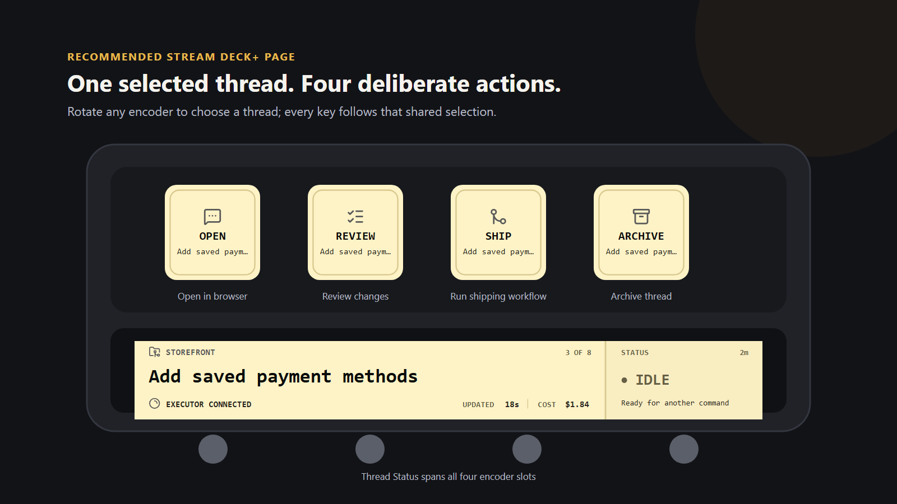
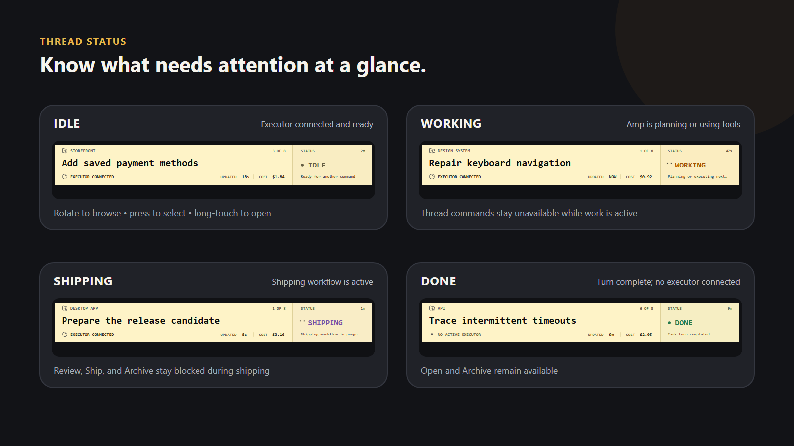
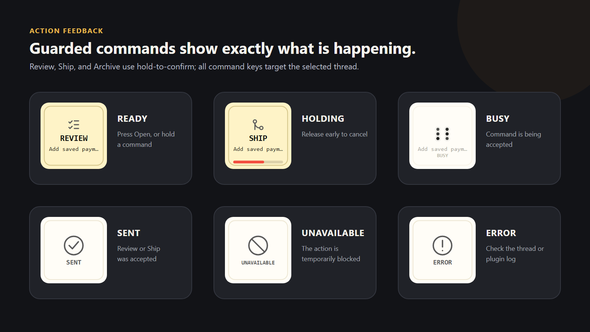
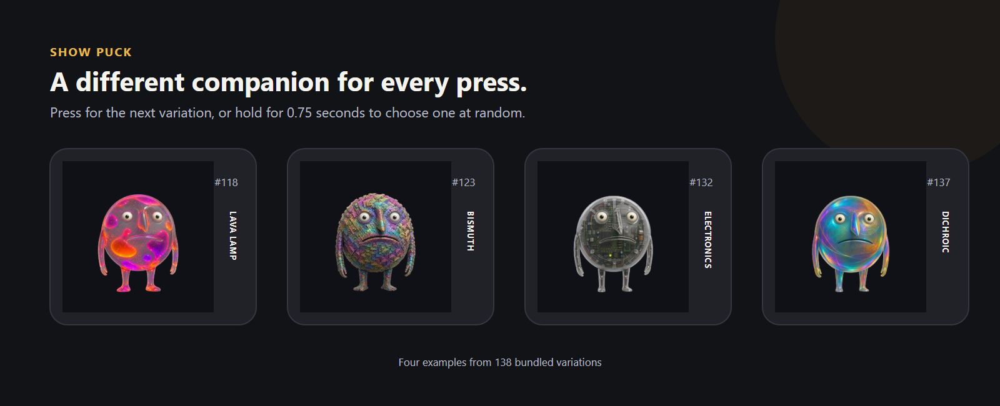

# Amp Deck

Amp Deck puts your active [Amp](https://ampcode.com/) threads on a Stream Deck+. Choose a thread from the touch strip, see whether it is working or ready, open it in your browser, and send common follow-up commands without returning to the terminal.



> [!NOTE]
> Amp Deck is an early, source-distributed release. There is no packaged download yet, so installation currently requires a local build.

## What you can do

- See all unarchived threads and their live state on the Stream Deck+ touch strip.
- Rotate any encoder to choose a thread; all Amp Deck keys follow the same selection.
- Open the selected thread in your default browser.
- Ask the selected thread to review changes or run its repository's shipping workflow.
- Archive a finished thread.
- Use hold-to-confirm for commands that can change code or thread state.
- Optionally add a Show Puck key with 138 bundled variations.

Amp Deck talks to the Amp CLI already installed on your computer. It does not need a separate account, API key, token, or pairing step.

## Before you start

You will need:

- a **Stream Deck+** for the complete four-encoder status display;
- **Stream Deck 7.1 or newer**;
- **macOS 12 or newer**, or **Windows 10 or newer**;
- the current [Amp CLI](https://ampcode.com/manual), signed in to your Amp account; and
- **Node.js 24 or newer** while building this source release.

Key actions such as Open, Review, Ship, Archive, and Show Puck also work on Stream Deck devices without encoders. Selecting threads and viewing the complete status surface require Stream Deck+.

## Install from source

Clone the project, install its dependencies, build it, and link it to Stream Deck:

```shell
git clone https://github.com/dinsley/ampdeck.git
cd ampdeck
npm ci
npm run build
npx streamdeck link com.daniel-insley.amp-deck.sdPlugin
```

If Amp Deck does not appear in the Stream Deck action list, restart the plugin:

```shell
npx streamdeck restart com.daniel-insley.amp-deck
```

To remove the development link later:

```shell
npx streamdeck unlink com.daniel-insley.amp-deck
```

## Set up your Stream Deck

1. Sign in to Amp and verify that it can list your threads:

   ```shell
   amp login
   amp top
   ```

2. Open the Stream Deck app and find **Amp Deck** in the action list.
3. Add **Thread Status** to all four encoder slots on one Stream Deck+ page. The four slots join into one continuous display.
4. Add **Open Thread**, **Review Thread**, **Ship Thread**, and **Archive Thread** to the keys above the display.
5. Rotate any encoder to choose a thread. The title shown on each command key updates with the shared selection.

Amp Deck looks for the standard Amp installation at `~/.amp/bin/amp` (`~/.amp/bin/amp.exe` on Windows), then falls back to the `amp` command available to the Stream Deck app.

## Use the plugin

### Choose and open a thread

The Thread Status display is the center of the plugin:

| Control                    | What it does                                                                                              |
| -------------------------- | --------------------------------------------------------------------------------------------------------- |
| Rotate any encoder         | Browse unarchived threads and select the thread now on screen. Shipping and working threads appear first. |
| Press any encoder          | Keep the visible thread selected.                                                                         |
| Tap the touch strip        | Keep the visible thread selected.                                                                         |
| Long-press the touch strip | Open the visible thread on `ampcode.com`.                                                                 |
| Press **Open Thread**      | Open the selected thread in your default browser.                                                         |

### Run a thread action

Review, Ship, and Archive are deliberately harder to trigger by accident. Hold the key until its progress bar completes; releasing early cancels the action.

| Action             |                Hold time | What it asks Amp to do                                                              |
| ------------------ | -----------------------: | ----------------------------------------------------------------------------------- |
| **Review Thread**  |                 1 second | Review the current changes, fix high-confidence issues, and report remaining risks. |
| **Ship Thread**    |                2 seconds | Follow the repository's configured shipping workflow with guarded instructions.     |
| **Archive Thread** |              1.5 seconds | Archive the selected thread through the Amp CLI.                                    |
| **Show Puck**      | Press / 0.75-second hold | Show the next bundled variation, or choose a random one after a hold.               |

Review and Ship require a connected executor and use a shared 10-second cooldown. Thread commands are disabled while the selected thread is working, shipping, offline, or already accepting another command.

## Understand the thread states



- **IDLE** — a live executor is connected and ready for another command.
- **WORKING** — Amp is actively planning or using tools in the thread.
- **SHIPPING** — a shipping command was accepted and its workflow is active.
- **DONE** — the current turn finished and no live executor is connected.

The display also shows the thread's project, title, place in the attention-ordered list, time in the current state, latest update, executor availability, and usage cost when available. Missing cost data does not disable the rest of the plugin.

## Understand action feedback



- A progress bar means the key is waiting for the hold to complete.
- **BUSY** means the request is being sent or another command is still cooling down.
- **SENT** means Amp accepted a Review or Ship request. The work may continue in the thread.
- **DONE** means a local action such as Open or Archive completed.
- **UNAVAILABLE** means the action is not safe to run in the current thread state.
- **ERROR** means the immediate action failed; check the Amp thread and plugin log before trying again.

Changing the selected thread while holding a command cancels the command.

## Show Puck



Show Puck is an optional key for adding a little personality to your Stream Deck. Press it to advance to the next variation, or hold it for 0.75 seconds to choose a different variation at random. The key briefly displays the variation's number and name.

## Troubleshooting

### The display says `AMP CLI OFFLINE`

Check Amp from a terminal:

```shell
amp update
amp login
amp top
```

Amp Deck reconnects automatically every few seconds. If `amp top` works but the display remains offline, restart the plugin:

```shell
npx streamdeck restart com.daniel-insley.amp-deck
```

### The display says `NO ACTIVE THREADS`

Amp is connected, but it cannot find an unarchived thread. Create or unarchive a thread, then give the display a moment to refresh.

### A command says `UNAVAILABLE`

Check that:

- a thread is selected;
- Amp is online;
- the thread is not currently working or shipping;
- Review and Ship have a connected executor; and
- another command is not still being sent or cooling down.

### Amp works in a terminal but not in Stream Deck

Desktop apps can have a different `PATH` from your terminal. Amp Deck detects the standard `~/.amp/bin/amp` installation directly. If Amp is installed elsewhere, make it available to desktop applications or reinstall it in the standard location, then restart Stream Deck.

### Review or Ship is unavailable on a completed local thread

The Amp CLI cannot safely restore a disconnected local thread's original checkout when another application continues it. Amp Deck therefore requires the executor that Amp already reports as connected. Reconnect the original runner, or continue the thread from a terminal opened in the intended repository. Archive remains available because it does not run repository tools.

### A command shows `ERROR`

Try the equivalent operation from the Amp CLI to expose authentication, permission, or connectivity errors. Review and Ship run in detached execute mode, so later approvals, clarification requests, or failures appear in the Amp thread rather than on Stream Deck.

Development builds write logs inside the linked `.sdPlugin` directory's `logs` folder.

## Safety and privacy

- Authentication stays with the local Amp CLI; Amp Deck does not store its own API key.
- Thread links are opened only when they are HTTPS URLs on `ampcode.com`.
- Review and Ship can edit files or interact with repository workflows under the selected thread's normal permissions and project guidance.
- Archive changes the thread's server-side archive state as soon as the hold completes.
- If Stream Deck stops or upgrades the plugin during a detached command, check the Amp thread before retrying.

## Development

Install dependencies and run the complete project check:

```shell
npm ci
npm run check
```

`npm run check` verifies formatting, linting, types, tests, the production bundle, and the Stream Deck manifest and layouts.

For local hardware iteration, link the plugin once and start watch mode:

```shell
npx streamdeck link com.daniel-insley.amp-deck.sdPlugin
npm run watch
```

Useful development commands:

| Command                                          | Purpose                                                        |
| ------------------------------------------------ | -------------------------------------------------------------- |
| `npm run build`                                  | Build the production plugin bundle.                            |
| `npm test`                                       | Run the Node.js test suite.                                    |
| `npm run lint`                                   | Run ESLint with zero warnings allowed.                         |
| `npm run typecheck`                              | Type-check without emitting files.                             |
| `npm run format`                                 | Format the repository with Prettier.                           |
| `npm run validate`                               | Validate the plugin manifest, assets, and layouts.             |
| `npx tsx scripts/generate-readme-screenshots.ts` | Regenerate the README screenshots from the real SVG templates. |

Amp's live `top --stream-jsonl` status schema is experimental. Amp Deck validates command-safety fields strictly and disables controls when it cannot trust a snapshot. Shipping-label restart recovery is best effort because the CLI search returns at most 100 matching threads; commands dispatched during the current plugin session remain authoritative.

## Project status

Amp Deck is an independent, early-stage project. Amp and Stream Deck behavior may change. When reporting a problem, include your operating system, Stream Deck version, Amp CLI version, and relevant plugin log messages.

The plugin version lives in `com.daniel-insley.amp-deck.sdPlugin/manifest.json`. Packaging and Marketplace publishing are maintainer tasks and are intentionally not part of the normal build.
