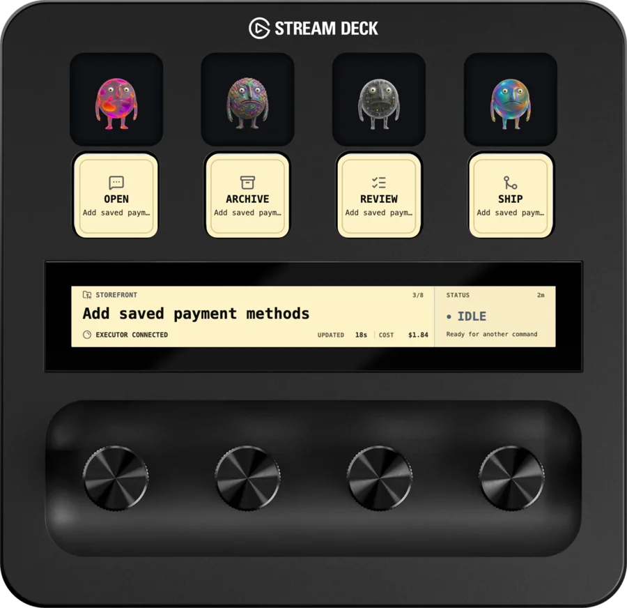

<h1 align="center">Amp Deck: Elgato Stream Deck+ Plugin</h1>

<p align="center">
  <a href="https://elgato.com"></a>
  <a href="https://github.com/dinsley/ampdeck/actions/workflows/check.yml"></a>
  <a href="https://github.com/dinsley/ampdeck/releases/latest"></a>
</p>

Amp Deck puts active [Amp](https://ampcode.com/) threads on a [Stream Deck+]. The touch strip shows what Amp is doing; the keys open threads and send common follow-up commands without a trip back to the terminal.

<p align="center">
  
  <a href="https://www.elgato.com/ca/en/p/stream-deck-plus"></a>
</p>

> Amp Deck is an unofficial Stream Deck plugin for Amp. It is not affiliated with or endorsed by Amp / Amp Code.

## What it does

- **See Amp at a glance.** Active, unarchived threads and their current state span the four [Stream Deck+] encoders.
- **Turn a dial, pick a thread.** Every Amp Deck key follows the same selection.
- **Work from the deck.** Open, review, ship, or archive the selected thread. Riskier commands use hold-to-confirm and block unsafe duplicates.
- **No second login.** The plugin uses the Amp CLI and account already on your computer.
- **Show Puck, if you want.** Add one of 138 bundled variations to any Stream Deck.

## Prerequisites

- a **[Stream Deck+]**;
- **Stream Deck 7.1 or newer**;
- **macOS 13.5 or newer**, or **Windows 10 or newer**;
- the current [Amp CLI](https://ampcode.com/manual), signed in to your Amp account.

### Supported devices

Only **[Stream Deck+]** is currently supported. It is the only device available for development and hardware testing, so other Stream Deck hardware should be considered untested.

A future goal is to support the [CORSAIR GALLEON 100 SD](https://www.elgato.com/ca/en/p/galleon-100-sd-stream-deck-integrated-mechanical-keyboard-ch-912a31i-na). Its integrated Stream Deck controls could support a more tailored Amp Deck experience than reusing the current four-encoder layout.

## Install

1. Open the [most recent Amp Deck release](https://github.com/dinsley/ampdeck/releases/latest).
2. Download `com.dinsley.ampdeck.streamDeckPlugin`.
3. Double-click the downloaded file and approve the installation in Stream Deck.
4. Confirm that **Amp Deck** appears in the Stream Deck action list.

To build from source instead, see [For contributors](#for-contributors).

## Set up your Stream Deck

1. Sign in to Amp and verify that it can list your threads:

   ```shell
   amp login
   amp top
   ```

2. Open the Stream Deck app and find **Amp Deck** in the action list.
3. Add **Thread Status** to all four encoder slots on one [Stream Deck+] page. The four slots join into one continuous display.
4. Add **Open Thread**, **Review Thread**, **Ship Thread**, and **Archive Thread** to the keys above the display.
5. Rotate any encoder to choose a thread. The title shown on each command key updates with the shared selection.

## Use the plugin

### Choose and open a thread

| Control                    | What it does                                                                                          |
| -------------------------- | ----------------------------------------------------------------------------------------------------- |
| Rotate any encoder         | Browse active threads and select the thread now on screen. Shipping and working threads appear first. |
| Press any encoder          | Keep the visible thread selected.                                                                     |
| Tap the touch strip        | Keep the visible thread selected.                                                                     |
| Long-press the touch strip | Open the visible thread on `ampcode.com`.                                                             |
| Press **Open Thread**      | Open the selected thread in your default browser.                                                     |

### Run a thread action

Hold Review, Ship, or Archive until the progress bar fills. Release early to cancel.

| Action             | How to use    | What it asks Amp to do                                                              |
| ------------------ | ------------- | ----------------------------------------------------------------------------------- |
| **Review Thread**  | Hold the key  | Review the current changes, fix high-confidence issues, and report remaining risks. |
| **Ship Thread**    | Hold the key  | Follow the repository's configured shipping workflow with guarded instructions.     |
| **Archive Thread** | Hold the key  | Archive the selected thread.                                                        |
| **Show Puck**      | Press or hold | Press for the next bundled variation, or hold to choose one at random.              |

Review and Ship need a connected executor. Thread commands stay unavailable while the selected thread is working, shipping, offline, or already handling another command. A short cooldown after dispatch prevents duplicate requests.

## Thread states

- **IDLE** — a live executor is connected and ready for another command.
- **WORKING** — Amp is actively planning or using tools in the thread.
- **SHIPPING** — a shipping command was accepted and its workflow is active.
- **DONE** — the current turn finished and no live executor is connected.

The display includes the project, thread title, position in the attention-ordered list, time in the current state, latest update, local/Orb execution origin and activity, token usage, and usage cost. Supplementary details are collected locally only while the Thread Status encoder is visible. If they are unavailable, everything else keeps working.

Execution origin and token usage are derived from `amp threads export`. Thread exports grow as long-running conversations accumulate messages, so Amp Deck currently caps exported thread data at 5 MiB. Threads whose exports exceed that limit continue to work, but their origin and token metadata may be unavailable.

## Action feedback

- A progress bar shows how long to keep holding the key.
- **BUSY** means the request is being sent or another command is still cooling down.
- **SENT** means Amp accepted a Review or Ship request; work may continue in the thread.
- **DONE** means a local action such as Open or Archive completed.
- **UNAVAILABLE** means the current thread state blocks that action.
- **ERROR** means the action failed immediately. Check the Amp thread and plugin log before retrying.

Changing the selected thread while holding a command cancels the command.

## Show Puck

Show Puck is optional. Press for the next variation, or hold for a random one. The key briefly shows its number and name.

See Amp's [What the Puck? list](https://ampcode.com/what-the-puck) for the full collection.

## Safety and privacy

- Authentication stays with the local Amp CLI; Amp Deck does not store its own API key.
- Amp Deck does not include analytics, telemetry, advertising, or a developer-operated network service.
- Thread links are opened only when they are HTTPS URLs on `ampcode.com`.
- Review and Ship can edit files or interact with repository workflows under the selected thread's normal permissions and project guidance.
- Archive changes the thread's server-side archive state as soon as the hold completes.
- If Stream Deck closes while a command is running, check the Amp thread before trying again.

## Credits and attribution

The bundled Puck images, Puck icon, Amp-derived iconography, and Amp / Amp Code design tokens are attributed to **[Amp / Amp Code](https://ampcode.com/)**.

The [Stream Deck+] device frame in the README is adapted from Elgato's [Stream Deck Kit simulator assets](https://github.com/elgatosf/streamdeck-kit-ipad), copyright Corsair Memory Inc. and provided under the [MIT License](./docs/assets/LICENSE.streamdeck-kit).

Amp, Amp Code, Puck, their associated artwork and icons, and their visual design language belong to their respective owners. Amp Deck is an independent project and is not affiliated with or endorsed by Amp / Amp Code.

## License

Amp Deck's original code and documentation are available under the [MIT License](./LICENSE).

The MIT License does not apply to bundled third-party software, Puck artwork, Amp-derived iconography, trademarks, or design elements. Those materials remain subject to their respective owners' rights.

## Contributing

See [CONTRIBUTING.md](./CONTRIBUTING.md) for development setup, project checks, hardware testing, and release instructions.

[Stream Deck+]: https://www.elgato.com/ca/en/p/stream-deck-plus
